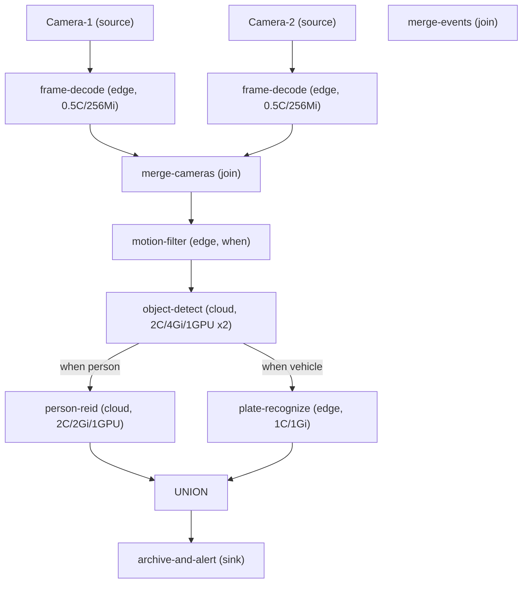

# IARNet 示例：智能交通视频分析流水线

本示例展示如何使用 IARNet Java DSL 构建面向云边协同场景的智能视频分析工作流。流水线模拟多摄像头实时交通监控的典型 DAG：在边缘端完成帧解码与运动过滤，在云端执行 GPU 密集型目标检测与识别，最终汇合生成统一事件流并触发异常告警。

## 论文支撑

| 论文 | 作者 | 会议/期刊 | 与本示例的关联 |
|------|------|-----------|----------------|
| **VideoStorm: Live Video Analytics at Scale with Approximation and Delay-Tolerance** | Zhang et al. | NSDI 2017 | 将视频分析建模为 DAG 流水线，研究资源-质量权衡与大规模调度 |
| **You Only Look Once: Unified, Real-Time Object Detection** | Redmon et al. | CVPR 2016 | 实时目标检测的算法基础（YOLO 家族） |
| **Neurosurgeon: Collaborative Intelligence Between the Cloud and Mobile Edge** | Kang et al. | ASPLOS 2017 | DNN 推理的云边协同分割，为异构资源声明提供理论依据 |

## 流水线架构



## 阶段说明

| 阶段 | DSL 操作 | 资源声明 | 说明 |
|------|----------|----------|------|
| 1 | `source(ConstantSource.of(...))` | — | 双路摄像头数据源 |
| 2 | `then("frame-decode", ...)` | 0.5C / 256Mi（边缘） | 帧解码，轻量计算部署在边缘 |
| 3 | `join("merge-cameras", ...)` | — | 多路视频流汇合 |
| 4 | `when(hasMotion).then("motion-filter", ...)` | 0.5C / 256Mi（边缘） | 运动过滤，仅保留有运动帧 |
| 5 | `then("object-detect", ...)` | 2C / 4Gi / 1GPU × 2（云端） | 目标检测，GPU 密集型 |
| 6a | `when(person).then("person-reid", ...)` | 2C / 2Gi / 1GPU（云端） | 行人重识别 |
| 6b | `when(vehicle).then("plate-recognize", ...)` | 1C / 1Gi（边缘） | 车辆号牌识别 |
| 7 | `join("merge-events", ...)` | — | 行人/车辆事件汇合 |
| 8 | `then("archive-and-alert", ...)` | — | 归档 + 异常告警 sink |

## DSL 特性覆盖

- **source**：多路数据源
- **then(name, function, config)**：语义化阶段名称 + 异构资源声明（边缘 vs 云端）
- **when(condition)**：条件分流（行人 / 车辆）
- **join(name, other, function)**：多路汇合（摄像头流、事件流）
- **then(name, SinkFunction)**：终点消费（归档 + 告警）

## 运行方式

### 前置条件

1. 设置环境变量：
   - `IARNET_APP_ID`：应用 ID
   - `IARNET_GRPC_PORT`：控制平面 gRPC 端口

2. 确保 IARNet 控制平面与资源适配器已启动。

### 编译与执行

```bash
# 从 iarnet 根目录
cd iarnet
mvn package -pl iarnet-example/java -am

# 运行（需先启动控制平面）
java -jar iarnet-example/java/target/iarnet-example-java-1.0.0-SNAPSHOT.jar
```

### 本地演示（无需控制平面）

示例中的处理逻辑均为 mock 实现，主要用于展示 DSL 表达能力和流水线拓扑。若仅需验证代码正确性，可直接在 IDE 中运行 `Main.main`，或在无环境变量时捕获 `IllegalStateException` 后观察工作流图构建逻辑。

## 与 Ray 典型示例的差异

| 维度 | Ray 典型示例 | 本示例 |
|------|--------------|--------|
| 任务类型 | 模型训练 + 批量推理 | 实时流式推理流水线 |
| 数据模式 | 批处理 Dataset | 流式帧序列 |
| 资源模型 | ScalingConfig 统一配置 | 每个算子独立声明 CPU/MEM/GPU |
| 拓扑 | 线性 preprocess→train→evaluate | 多源汇合 + 条件分流 + 再汇合的复杂 DAG |
| 场景 | NLP / 表格数据 | 视频分析（云边协同） |

## 参考

- [IARNet 项目概述](../README.md)
- [工作流 DSL 文档](../iarnet-sdks/iarnet-sdk-java/README.md)（若有）
